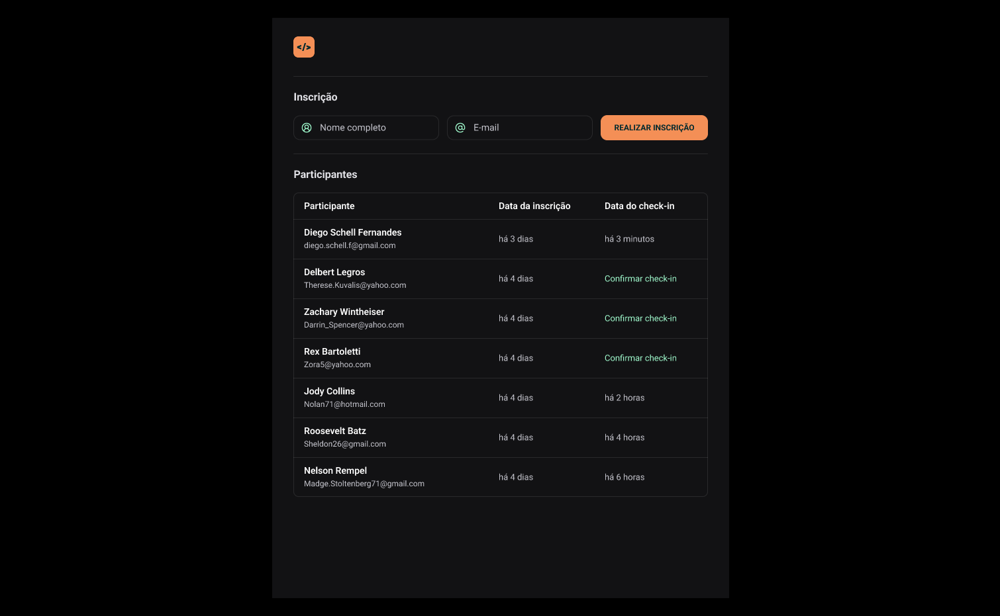

  

Aplicação desenvolvida no NLW Unite da Rocketseat na trilha HTML+CSS+JS.

  <a href="#-tecnologias">Tecnologias</a>&nbsp;&nbsp;&nbsp;|&nbsp;&nbsp;&nbsp;
  <a href="#-projeto">Projeto</a>&nbsp;&nbsp;&nbsp;|&nbsp;&nbsp;&nbsp;
  <a href="#memo-licença">Licença</a>

  

 

  

## 💻 Projeto

Nesse projeto foi desenvolvido uma versão simplificada de um sistema de check-in para eventos presenciais.

## 🚀 Tecnologias

Esse projeto foi desenvolvido com as seguintes tecnologias:

- HTML
- SASS
- JavaScript
- [Google Fonts](https://fonts.google.com/)
- [Dayjs](https://day.js.org/)

### 📚 Aprendizados:

- Semântica e boas práticas
- Fundamentos do Javascript
- Biblioteca Dayjs para manipulação de datas 

##  🔖 Layout

Você pode visualizar o layout do projeto através [desse link](https://www.figma.com/community/file/1356738933008624188/pass-in). É necessário ter conta no [Figma](https://figma.com) para acessá-lo.

## 📝 Licença

Esse projeto está sob a licença MIT.

 

> Status do projeto: em andamento ⏳